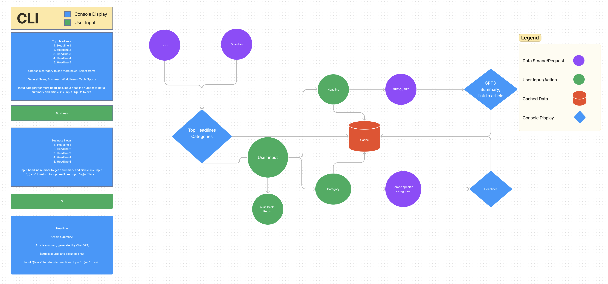

# Project News_Bytes
 
## Project News_Bytes

### This application runs on the command line. 

[News_Bytes Application](/news/bytes_app.py)
---
## Web Application

[Requirements and Vision Statement](/Documentation/requirements.md)

---

## Tools Used

- PyCharm
- Trello
- Figma
- Python
- Pytest

---

## Recent Updates

#### V 1.0
*Initial creation of News_Bytes Project to include Trello setup and documentation/development planning* - 10 Dec 2022

#### V 1.1
*Initial creation of function get_headlines() to scrape the top ten headlines. Initialization of ChatGPT for scraping - 12 Dec 2022*

#### V 1.2
*Initial implementation of Rich library with headlines_table() and categories_panel() in menu.py. - 13 Dec 2022*

---

## Getting Started

Clone this repository to your local machine.
Install dependencies if not already installed, refer to dependencies in requirements.txt.
In the command line run python3 bytes_app.py.

```
$ git clone https://github.com/Sleuthsz/News_Bytes.git
```
Once downloaded, activate your virtual environment and run by running your .venv file.

```
python3 -m venv .venv
source .venv/bin/activate
```
Navigate into 
```
cd YourRepo/YourProject

```
Unit testing is included in the tests folder in your project using the pytest test framework.

---

### Trello Board

[Trello Board](https://trello.com/b/mzyzdVX4/newsbytes)

---
## Data Flow



---

## Change Log

1.0 Initial creation of News_Bytes Project to include Trello setup and documentation/development planning - 10 Dec 2022

1.1 Initial creation of function get_headlines() to scrape the top ten headlines. Initialization of ChatGPT for scraping - 12 Dec 2022

1.2 Initial implementation of Rich library with headlines_table() and categories_panel() in menu.py. - 13 Dec 2022


---

## Authors

Monika Davies
Alejandro Rivera
Daniel Brott
Andy Nguyen
Natalija Germek
