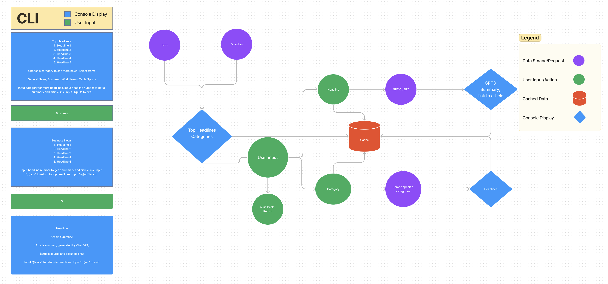

# Software Requirements

---

## Vision

### What is the vision of this product?

The goal of this project is to create a streamlined news-gathering experience. The console application allows the user to select a category of news and then receive a nicely formatted news feed in their console. Categories include topics like general-news, business, world-news, tech and sports. The application delivers news headlines, and the user can then request summaries of specific articles. Summaries are provided by ChatGPT.

### What pain point does this project solve?

Sorting through news articles is time consuming, so this application presents a concise and organized list of headlines that can be further sorted by category. Additionally, the application draws from multiple news sources to provide a more balanced picture.

### Why should we care about your product?

The application allows users to stay informed and efficiently consume diverse news sources. In addition to organizing headlines, the app provides summaries on request as well as links to the original articles.

## Scope (In/Out)

>IN

* Provide top 5 popular news headlines
* Offers news categories to provide additional headlines tailored to user preferences
* Provides article summaries on demand
* Provides article links and sources

>OUT

* The application is not going to be deployed
* The application will not have a login or authentication feature

## Minimum Viable Product

### What will your MVP functionality be?

Console application that gives the user 5 popular news headlines, and the option to request additional news headlines by category. The application returns attractively formatted news headline results (scraped from at least 5 news websites) and allows the user to select articles they want to learn more about. The user can also enter their zip code to retrieve local news headlines. When the user selects an article, the app returns a summary of the article (generated by ChatGPT) as well as the source of the article and a link to the article. The application implements caching to store recent user data.

### What are your stretch goals?

* Scrape data from more news sources.
* Link to further information or "similar stories" based on user input.
* Ask GPT its opinion on a specific news article.

## Functional Requirements

* User can ask for categories of news.
* User can ask for news article summaries.
* User can ask for news article links and sources.
* User can return to previous searches.

## Data Flow

## Non-functional requirements

* **Usability** 
  * Our application should broadly cater to all users. It uses a python library to format console text for better readability. This includes size, spacing and color.

* **Testability** 
  * We use pytest for testing our application. 
  * We follow principles of test driven development.
  * In order to ensure proper functionality, test coverage is 80%.
